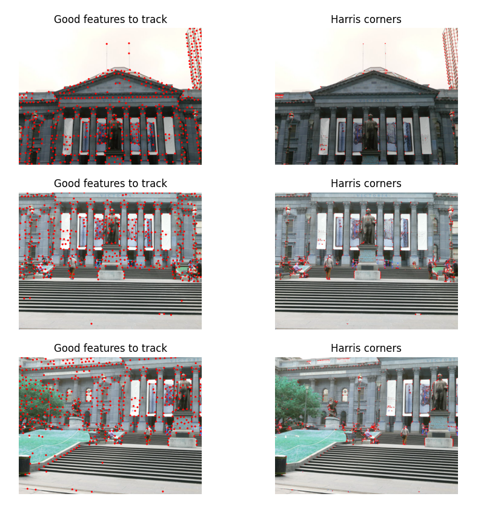
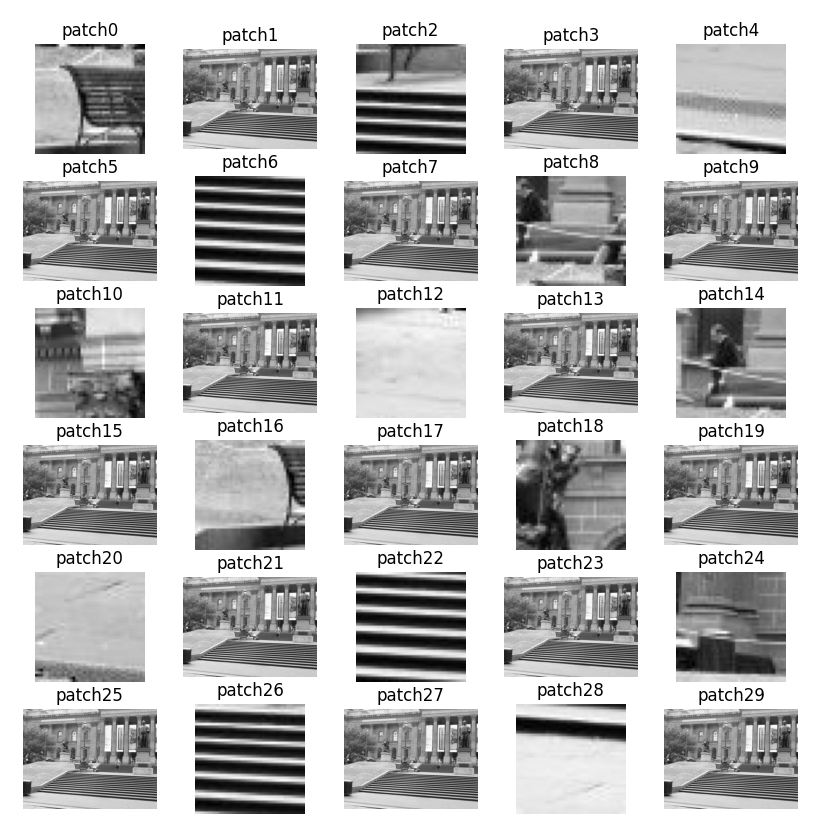
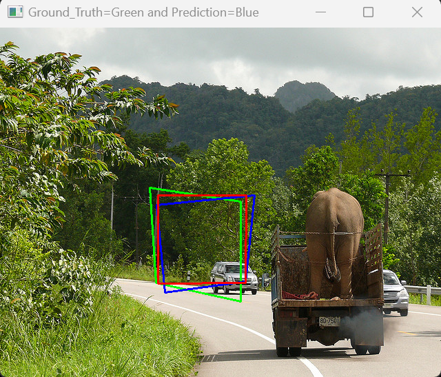

# AutoPano
The purpose of this repository is to stitch two or more images in order to create one seamless panorama image. The functions covered are Corner detection, Adaptive Non-Maximal Suppression, Feature Matching, RANSAC for outlier rejection,  Homography estimation and Blending.

## About The Project

This report presents image stitching pipelines using traditional computer vision and modern deep learning techniques. Phase 1 implements feature extraction, matching, RANSAC and blending to create panoramas. Phase 2 develops supervised and unsupervised convolutional neural networks (CNN) to predict homographies. Quantitative and qualitative results compare classical and learning methods. This project provides end-to-end experience in applying fundamental techniques alongside recent deep learning innovations for geometric computer vision tasks. The implemented pipelines could form the basis of real-world panoramic image and video capturing systems.

## Classical Approach 
  ###   Corner Detection
 

  ###   Feature generation
 

  ###   Feature matching and RANSAC
 

  ###   Image stitching
 

## Other results
1 | 2 | 3
:---: | :---: | :---: 
 |  |  

## Deep Learning Approach 

  ###  Ground Truth vs Supervised model 
 
 
 

  ### Loss graph
 

  ### Ground Truth vs Supervised model vs unsupervised model
  
 
 
 
 

  ### Loss graph
 
